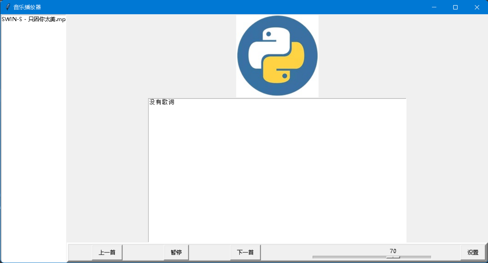

这是一款基于Python的简易音乐播放器, 使用pygame库实现播放音乐

适用于Windows, Linux没有尝试过, 不出意外的话应该行

运行方式很简单, 执行main.py或main2.py

main.py的GUI使用Python标准库tkinter

main2.py使用ttkbootstrap库

提示: 

    1.如果要打开自定义的目录, 就删除./temp文件夹或者删除./config.json中的"folder"的值

    2.程序读取的歌词文件格式: 音乐文件名(不加后缀名).lrc

