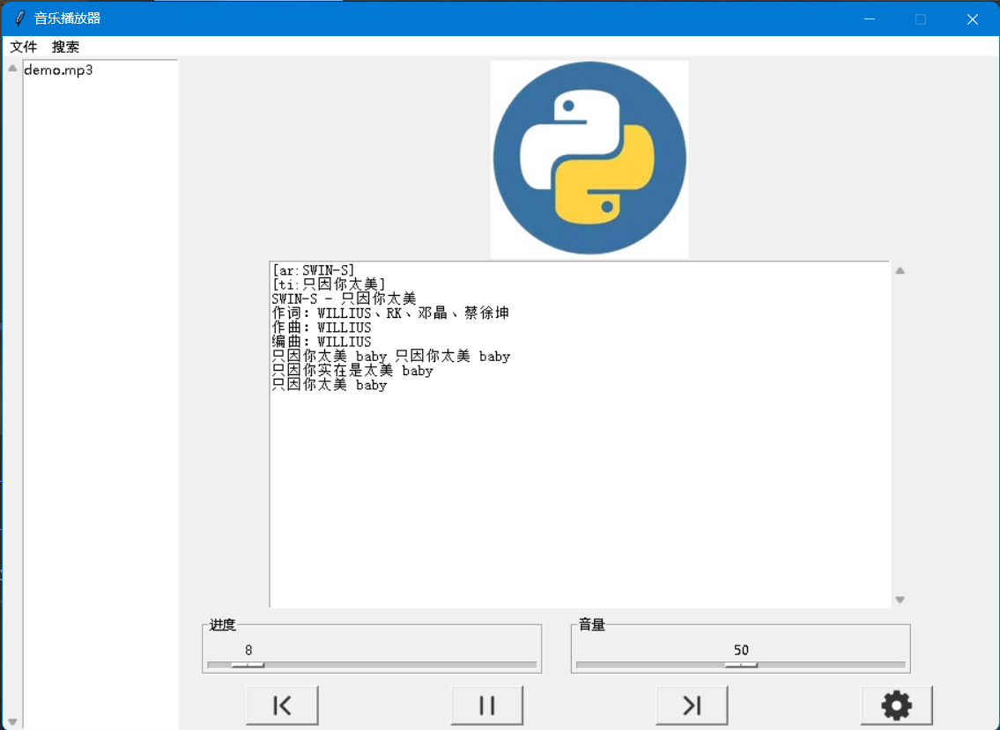
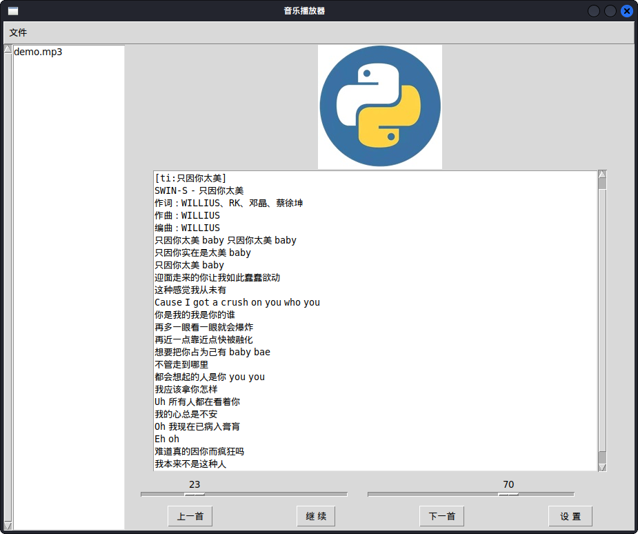

# music-player
[](https://opensource.org/licenses/MIT)
## License
This project is licensed under the MIT License. See [LICENSE](LICENSE) for details.

# 1.简介
这是一款基于Python的简易音乐播放器, 使用pygame库实现播放音乐

运行方式很简单, 执行main.py或main2.py

main.py的GUI使用Python标准库tkinter

## 截图

## Windows



## linux(以kali示范)



# 2.安装
## 1.克隆仓库并进入目录

## 2.安装第三方库:
### linux
首先安装Python3-tk包

基于Debian的Linux发行版（如Ubuntu、Linux Mint等）
```bash
sudo apt-get update
sudo apt-get install python3-tk
```
在基于RHEL的Linux发行版（如CentOS、Fedora等）
```bash
sudo yum install python3-tk
```
或者，如果你使用的是基于Arch的Linux发行版（如Manjaro、Antergos等）
```bash
sudo pacman -S python-tk
```
然后安装Python第三方库(在这之前, 请确保已安装了pip包)

pip包的安装
```bash
sudo apt-get install python3-pip
```
pip安装依赖
```bash
pip3 install -r .\requirements.txt
```
### Windows
```bash
pip3 install -r .\requirements.txt
```

# 注意:

    1.如果要打开其他音乐文件夹(或打开单个音乐文件), 请单击左上方的"文件"

    2.程序读取的歌词文件格式: 音乐文件名(不加后缀名).lrc

    3.python版本 >= 3.8(程序中用到了':=')

    初学作者，有不好的地方还请多多指教